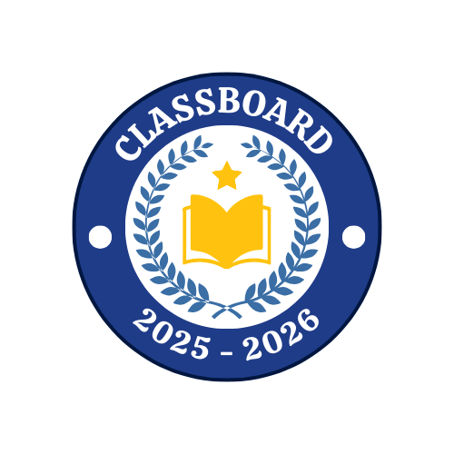

# 📘 Projeto Integrador II – Engenharia de Software  

## 📌 Informações Gerais
- **Disciplina:** Projeto Integrador II  
- **Curso:** Engenharia de Software  
- **Semestre:** 2025/2  
- **Turma:** T2  
- **Grupo:** G12  
- **Professor:** Lua Marcelo Muriana  

## 👨‍💻 Integrantes do Grupo
- Carlos Liberato  
- Felipe Miranda  
- Gabriel Coutinho  
- Leonardo Amad  
- Nicolas Reis  

---

## 🌟 Projeto ClassBoard

  

O **ClassBoard** é uma aplicação web inovadora voltada para **docentes do ensino superior**, com o objetivo de gerenciar notas e desempenho acadêmico de seus estudantes de forma **intuitiva, segura e automatizada**.  

Atualmente, muitos professores dependem de planilhas como Excel para registrar notas, o que limita a integração com sistemas institucionais e dificulta o gerenciamento eficiente ao longo do tempo. O ClassBoard resolve esse problema, permitindo que o docente:

- Cadastre instituições, disciplinas e turmas com facilidade;  
- Importe e gerencie listas de estudantes via CSV ou JSON;  
- Lance notas em diferentes atividades e provas;  
- Calcule automaticamente a nota final de cada disciplina;  
- Acesse e exporte dados de qualquer lugar, com hospedagem em nuvem ou servidor dedicado.  

O projeto é **100% web**, focado na praticidade do docente, sem necessidade de hotsites, páginas informativas ou recursos de marketing.

---

## 🛠 Funcionalidades Principais

### 1. Autenticação
- Cadastro de conta com **nome, e-mail, telefone e senha**;  
- Recuperação de senha via e-mail (“Esqueci minha senha”);  
- Não há acesso anônimo ou modo visitante;  
- A primeira tela após abrir o sistema é a de **login/autenticação**.  

### 2. Gerenciamento de Instituições, Disciplinas e Turmas
- Cadastro de pelo menos uma instituição e disciplina ao acessar o sistema;  
- Criação de turmas vinculadas a disciplinas, com possibilidade de múltiplas turmas por disciplina;  
- Exclusão de turmas solicita confirmação via e-mail para evitar perda acidental de dados;  
- Exclusão de instituições depende da remoção prévia de turmas e disciplinas associadas.  

### 3. Cadastro e Importação de Estudantes
- Cadastro manual ou em lote (via **CSV ou JSON**);  
- **CSV:** apenas as duas primeiras colunas são utilizadas (identificador + nome do estudante);  
- **JSON:** suporta múltiplos formatos de campos (`id`, `RA`, `matrícula` e `nome`, `fullName`, `completeName`);  
- Verificação automática de duplicatas para evitar registros repetidos;  
- Gerenciamento completo: incluir, editar ou remover estudantes de forma individual ou múltipla.

---

## 🚀 Tecnologias Previstas
- Aplicação web responsiva (Front-end e Back-end integrados);  
- Suporte a exportação e importação de dados;  
- Hospedagem em nuvem ou servidor dedicado;  
- Garantia de **segurança e integridade de dados**, com confirmações para operações críticas.  

---

## 📄 Estrutura do Projeto
- **/frontend** – Interface web responsiva e amigável;  
- **/backend** – Lógica de negócio e persistência de dados;  
- **/docs** – Documentação técnica e fluxos de uso;  
- **/tests** – Testes automatizados para garantir qualidade do sistema.  

---

## 💡 Objetivo
Entregar uma ferramenta que transforme o **controle de notas** em algo mais seguro, confiável e acessível, respeitando a propriedade intelectual do docente e promovendo maior integração entre **professor, estudante e instituição**.
